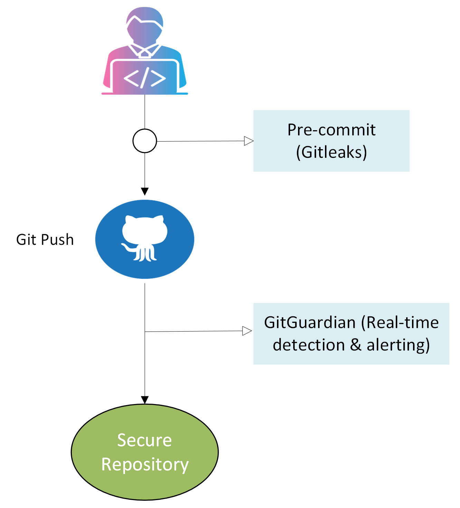

# 🔐 Git Secret Incident Response (DevSecOps)

This repository demonstrates a real-world DevSecOps incident:
**a secret accidentally pushed to a Git repository**.

## 🎯 Objectives
- Detect exposed secrets
- Revoke and rotate compromised credentials
- Remove secrets from Git history
- Implement preventive security controls

## 🛠 Tools
- GitGuardian (continuous monitoring & incident management)
- Gitleaks (local or CI/CD secret scanning)
- Git
- Pre-commit hooks

## 📚 Repository Structure
See `/incident` for step-by-step remediation.

## 🧠 Key DevSecOps Takeaway

Security cannot rely on a single control.

- Gitleaks prevents secrets from entering the repository
- GitGuardian detects and manages incidents at scale

## 🔄 DevSecOps Secret Detection & Incident Response Flow

This diagram illustrates a defense-in-depth approach.

**Defense in depth is mandatory.**

## 🔗 Portfolio
This project is part of my DevSecOps portfolio.